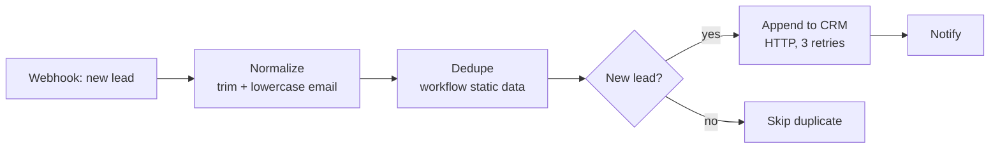
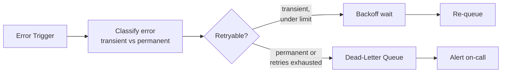
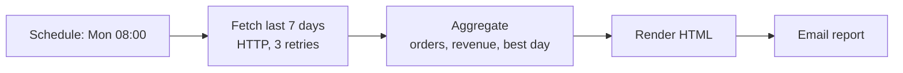

# n8n Automation Hub — versioned workflows, not screenshots

**Three production-shaped [n8n](https://n8n.io) workflows, exported as version-controlled JSON, self-hostable with one `docker compose up`, and structurally validated in CI so they actually import. Most n8n "portfolios" are screenshots you can't run — these are restorable, reviewable, and documented with the failure modes they handle.**

n8n is the automation tool most European "Automation Specialist / Workflow Automation" job posts name after Power Automate. This repo shows I can build *reliable* automations in it — idempotency, retries, and a dead-letter queue — not just wire two nodes together.

 [](https://github.com/minhazda/n8n-automation-hub/actions/workflows/ci.yml) 

---

## The workflows

### 1. Lead Intake — [`01-lead-intake.json`](workflows/01-lead-intake.json)



Form webhook → normalize → **idempotent dedupe** → CRM → notify. The dedupe uses n8n's workflow static data to remember emails it has already seen, so a form double-submit or a webhook redelivery never creates a duplicate lead. The CRM call retries 3× with backoff.

### 2. Error Handler with dead-letter queue — [`02-error-handler-dlq.json`](workflows/02-error-handler-dlq.json)



Register this as n8n's **global error workflow** and every other workflow's failures flow through it. Transient errors (timeouts, 429/503, connection resets) get a bounded number of backed-off retries; everything else lands in a dead-letter queue with an alert — the same pattern I use in my [streaming fraud detector](https://github.com/minhazda/streaming-fraud-detection), here at the workflow layer.

### 3. Weekly Report — [`03-weekly-report.json`](workflows/03-weekly-report.json)



Scheduled data pull → aggregate → formatted email. The unglamorous automation that quietly replaces a manual Monday-morning spreadsheet.

---

## Run it

```bash
git clone https://github.com/minhazda/n8n-automation-hub.git
cd n8n-automation-hub
docker compose up -d                     # n8n at http://localhost:5678
```

Import the workflows (either from the UI — *Workflows → Import from File* — or the CLI):

```bash
docker compose exec n8n n8n import:workflow --separate --input=/workflows
```

Then in n8n: set **Error Handler** as the default error workflow (Settings → set `N8N_DEFAULT_ERROR_WORKFLOW`), and swap the `Notify` / `Alert` NoOp nodes for real Slack/email nodes with your credentials. The HTTP URLs point at `example.com` placeholders — repoint them at your systems.

---

## Validate (what CI runs)

```bash
npm test          # node validate-workflows.mjs
```

The validator parses every export and asserts: valid JSON, required node fields present, unique node names/ids, and — the one that actually bites — **every connection references a node that exists**. That's the difference between "here are some JSON files" and workflows a reviewer can import without them silently breaking.

```
✓ 01-lead-intake.json  (7 nodes)
✓ 02-error-handler-dlq.json  (7 nodes)
✓ 03-weekly-report.json  (5 nodes)
All 3 workflows valid.
```

---

## Why it's built this way

- **Version-controlled JSON, not screenshots.** Every workflow is diffable, restorable, and reviewable in a PR.
- **Reliability patterns first.** Idempotent dedupe, bounded retries with backoff, and a dead-letter queue — the things that separate an automation you can leave running from one you have to babysit.
- **Self-contained.** `docker compose up` gives a reviewer a running n8n with the workflows one import away.
- **CI-guarded.** Broken connections fail the build, so the repo never drifts into an un-importable state.

*Built by [MD Minhazur Rahman](https://github.com/minhazda). Credentials/URLs are placeholders — no real systems are touched.*
